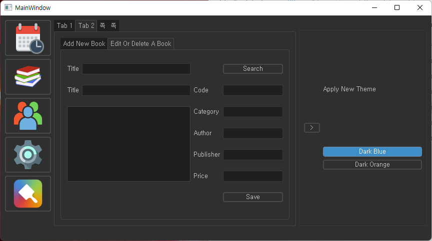

# Library Management System

Reference: [Udemy - Build Library Management System | Python & PyQt5](https://www.udemy.com/course/build-library-management-system-python-pyqt5/)  

## Required Packages
```bash
pip install pyqt5
pip install pyqt5-tools
pip install cx_Freeze
```
## Screenshot


## Tips
```bash
# QtDesigner
pyqt5-tools designer

# *.qrc -> *.py
pyrcc5 icons.qrc -o icons_rc.py

# *.ui -> *.py
pyuic5 library.ui -o library.py

# Build an executable file(Output directory: build/)
python setup.py build
```